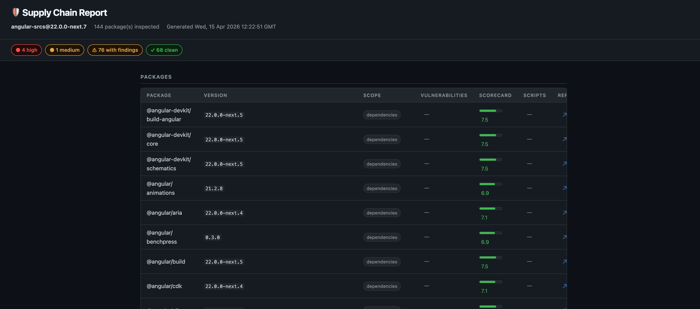
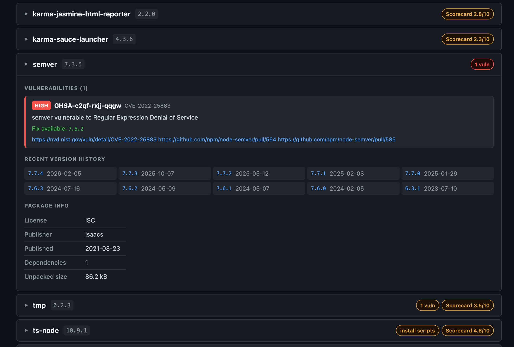

# 🛡️ Supply Chain Inspector

> A standalone, zero-dependency Node.js script for supply chain security analysis
> of npm dependencies. Queries public security APIs for every package and delivers
> a formatted terminal report **and** a shareable standalone HTML report — with no
> install step required.





---

## Features

- **Vulnerability scanning** via [OSV.dev](https://osv.dev) — known CVEs and
  security advisories, severity-ranked (Critical / High / Medium / Low)
- **Project health scoring** via [OpenSSF Scorecard](https://scorecard.dev) — 10+
  automated checks covering code review, branch protection, signed releases, and more
- **Install-script detection** — flags packages that run `preinstall`, `postinstall`,
  `prepare`, and other lifecycle hooks (a common malware vector)
- **Publisher history** — tracks who published each version to spot account takeovers
- **Version history** — configurable look-back window for detecting dormancy,
  publish bursts, or suspicious major jumps
- **Transitive dependency support** — optionally scan every resolved package in
  `package-lock.json`, not just direct dependencies
- **Lockfile-aware** — auto-detects `package-lock.json` for exact pinned versions
  instead of resolving from semver ranges
- **File cache** — API responses are cached to disk (npm: 6 h, OSV: 6 h,
  Scorecard: 24 h) so repeated runs are fast and network-friendly
- **In-flight deduplication** — concurrent workers that request the same package
  or repo share one HTTP request instead of firing duplicates
- **Zero dependencies** — uses Node.js 18+ built-in `fetch`; nothing to install

---

## Requirements

- **Node.js 18 or later** (uses native `fetch`)
- No npm install required — the script is fully self-contained, or use `npx` to run it directly from the registry

---

## Quick Start

```bash
# Run directly via npx — no install needed
npx supply-chain-inspector path/to/package.json

# Or install globally once to get the short "nsci" alias
npm install -g supply-chain-inspector
nsci path/to/package.json

# Or clone/copy the script and run it locally
node inspect-dependencies.js path/to/package.json
```

Typical output:

```
Supply Chain Inspector
Package: my-app 1.0.0
Source:  /home/user/my-app/package.json
Lockfile: /home/user/my-app/package-lock.json (312 resolved versions)
Cache:    /home/user/my-app/.cache

Inspecting 14 package(s) — concurrency: 5

  → express  (^4.18.2)
  → lodash   (^4.17.21)
  ...

━━━━━━━━━━━━━━━━━━━━━━━━━━━━━━━━━━━━━━━━━━━━━━━━━━━━━━━━━━━━━━━━━━━━━━━━━━━━━━
  SUPPLY CHAIN REPORT  ·  my-app@1.0.0  ·  14 package(s)
━━━━━━━━━━━━━━━━━━━━━━━━━━━━━━━━━━━━━━━━━━━━━━━━━━━━━━━━━━━━━━━━━━━━━━━━━━━━━━

  PACKAGE           VERSION     VULNS          SCORECARD        SCRIPTS
  ─────────────────────────────────────────────────────────────────────────────
  express           4.18.3      0              ████████░░ 7.8   ─
  lodash            4.17.21     1 high         ██████░░░░ 5.2   ─
  ...
```

---

## Usage

```
# Via npx (no install required)
npx supply-chain-inspector <path/to/package.json> [options]

# Via short alias (requires: npm install -g supply-chain-inspector)
nsci <path/to/package.json> [options]

# Or if running the script directly
node inspect-dependencies.js <path/to/package.json> [options]
```

---

## Options

### Dependency Scope

By default only `dependencies` (production) are scanned.

| Flag | Description |
|---|---|
| `--include-dev` | Also inspect `devDependencies` |
| `--include-peer` | Also inspect `peerDependencies` |
| `--include-optional` | Also inspect `optionalDependencies` |
| `--include-transitive` | Also inspect every transitive package resolved in `package-lock.json`, deduplicated by `name@version`. Packages already present as direct deps are skipped. **Requires a lockfile.** |

### Version History

```
--version-history=<N>    Versions to keep per package (default: 10, min: 2)
```

| Value | What it enables |
|---|---|
| `2` | Downgrade / major-jump detection only |
| `5` | + Rapid publish burst + dormancy detection |
| `10` | + Cadence baseline (recommended) |
| `20+` | Broader history, larger JSON output |

### Data Collection

| Flag | Description |
|---|---|
| `--concurrency=<N>` | Max parallel package fetches (default: `5`) |
| `--lockfile=<path>` | Path to `package-lock.json` (auto-detected next to `package.json` if omitted) |
| `--no-scorecard` | Skip OpenSSF Scorecard lookups (faster, useful offline) |
| `--no-vulns` | Skip OSV.dev vulnerability lookups |

### Cache

| Flag | Description |
|---|---|
| `--cache-dir=<path>` | Directory for cached API responses (default: `.cache/` next to the script) |
| `--no-cache` | Disable file cache; always fetch live data |

Cache TTLs are fixed and not configurable. Delete cache files manually to force
an early refresh:

| Source | TTL | Rationale |
|---|---|---|
| npm Registry | 6 h | Refreshed when new versions are published |
| OSV.dev | 6 h | Vulnerability data is stable within hours |
| OpenSSF Scorecard | 24 h | Scores are recomputed weekly by OpenSSF |

### Report

| Flag | Description |
|---|---|
| `--findings` | Show per-package findings detail below the summary table. By default only the table is shown; a one-line hint indicates how many packages have signals. |

### Output

| Flag | Description |
|---|---|
| `--json` | Print the full result array as JSON to stdout |
| `--output=<path>` | Write JSON to a file (implies `--json`) |
| `--html=<path>` | Write a fully standalone HTML security report to a file (no server or internet connection required to view) |

### Color

Set `NO_COLOR=1` in the environment to disable ANSI colors. Colors are also
automatically disabled when stderr is not a TTY (e.g. piped output).

---

## Output Modes

The formatted report always goes to **stderr**. **stdout** is reserved exclusively
for JSON so you can pipe cleanly.

```bash
# Report only — clean terminal view, no JSON noise
node inspect-dependencies.js package.json

# Report on stderr + JSON on stdout — pipe JSON to another tool
node inspect-dependencies.js package.json --json

# Report on stderr + JSON saved to a file — review both independently
node inspect-dependencies.js package.json --output=results.json

# Write a standalone HTML report — open report.html in any browser
node inspect-dependencies.js package.json --html=report.html

# HTML report + JSON side by side (useful for both humans and tooling)
node inspect-dependencies.js package.json --html=report.html --output=results.json

# Suppress the report, get only JSON (useful for scripting)
node inspect-dependencies.js package.json --json 2>/dev/null

# Pipe JSON straight into an AI tool
node inspect-dependencies.js package.json --json | llm "analyze these deps"
```

---

## Common Recipes

```bash
# Scan all dependency groups, save JSON for later AI analysis
node inspect-dependencies.js package.json \
  --include-dev --include-peer \
  --output=scan.json

# Generate an HTML report for easy sharing with your team
node inspect-dependencies.js package.json --html=report.html

# Full scan with HTML report, JSON data, and findings detail
node inspect-dependencies.js package.json \
  --include-dev --include-peer \
  --output=scan.json --html=report.html --findings

# Full deep scan — all groups, all transitive deps, with findings detail
node inspect-dependencies.js package.json \
  --include-dev --include-peer --include-optional --include-transitive \
  --findings

# Quick scan — skip Scorecard (no outbound calls to api.scorecard.dev)
node inspect-dependencies.js package.json --no-scorecard

# High concurrency for large lockfiles (mind API rate limits)
node inspect-dependencies.js package.json --concurrency=10

# CI-friendly: plain text, no color, output to log file
NO_COLOR=1 node inspect-dependencies.js package.json 2>&1 | tee security-report.txt

# Force fresh data, bypassing any cached responses
node inspect-dependencies.js package.json --no-cache

# Share a single cache across multiple projects to avoid redundant API calls
node inspect-dependencies.js package.json --cache-dir=~/.supply-chain-cache

# Inspect only production deps with narrow version history (fastest)
node inspect-dependencies.js package.json --version-history=2 --no-scorecard
```

---

## Security Signals

The `--findings` flag expands details for any package that triggers one or more
of the following signals:

| Signal | Meaning |
|---|---|
| `vulns` | One or more known CVEs or advisories from OSV.dev |
| `scripts` | Package declares lifecycle scripts (`preinstall`, `postinstall`, `prepare`, etc.) |
| `low_scorecard` | OpenSSF Scorecard score below 5 / 10 |
| `very_recent` | Package version was published fewer than 48 hours ago |
| `no_repo` | No source repository URL found in the npm registry entry |
| `not_found` | Package could not be found on the npm registry at all |

---

## JSON Output Structure

Each element of the output array represents one inspected package:

```json
{
  "name": "express",
  "versionSpec": "^4.18.2",
  "resolvedVersion": "4.18.3",
  "lockfileVersion": "4.18.3",
  "scope": "dependencies",
  "ecosystem": "npm",
  "sourceRepository": "https://github.com/expressjs/express",
  "notFound": false,
  "collectedAt": "2025-01-15T10:23:00.000Z",

  "registry": {
    "name": "express",
    "publishedHoursAgo": 2160,
    "publisher": "dougwilson",
    "hasInstallScripts": false,
    "repository": "https://github.com/expressjs/express",
    "homepage": "https://expressjs.com",
    "license": "MIT",
    "directDependencies": 30,
    "dependencyCount": 30,
    "devDependencyCount": 14,
    "peerDependencyCount": 0,
    "unpackedSize": 210000,
    "integrity": "sha512-...",
    "tarball": "https://registry.npmjs.org/express/-/express-4.18.3.tgz",
    "maintainers": ["dougwilson", "wesleytodd"]
  },

  "versionHistory": [
    { "version": "4.18.3", "date": "2024-03-01T00:00:00.000Z" },
    { "version": "4.18.2", "date": "2022-10-08T00:00:00.000Z" }
  ],

  "publisherHistory": [
    { "version": "4.18.3", "publisher": "wesleytodd" },
    { "version": "4.18.2", "publisher": "dougwilson" }
  ],

  "vulnerabilities": {
    "summary": {
      "total": 0,
      "critical": 0,
      "high": 0,
      "medium": 0,
      "low": 0,
      "unknown": 0
    },
    "list": [],
    "error": null
  },

  "scorecard": {
    "score": 7.8,
    "repoChecked": "github.com/expressjs/express",
    "checks": [
      { "name": "Code-Review", "score": 10, "reason": "all changesets reviewed" },
      { "name": "Branch-Protection", "score": 8, "reason": "..." }
    ],
    "signals": {
      "maintained": 10,
      "codeReview": 10,
      "vulnerabilities": 10,
      "signedReleases": -1,
      "branchProtection": 8,
      "securityPolicy": 9,
      "dangerousWorkflow": 10,
      "binaryArtifacts": 10,
      "pinned": 2,
      "ciTests": 9
    },
    "error": null
  }
}
```

### Field Reference

| Field | Description |
|---|---|
| `name` | Package name as it appears in `package.json` |
| `versionSpec` | The version range or tag from `package.json` (e.g. `^4.18.2`) |
| `resolvedVersion` | The actual version that was inspected (from lockfile or registry) |
| `lockfileVersion` | The version pinned in `package-lock.json`, if available |
| `scope` | Which dependency group this came from (`dependencies`, `devDependencies`, `peerDependencies`, `optionalDependencies`, `transitive`) |
| `notFound` | `true` if the package could not be found on the npm registry |
| `collectedAt` | ISO 8601 timestamp of when the data was collected |
| `registry.hasInstallScripts` | `true` if the package declares any lifecycle scripts |
| `registry.publishedHoursAgo` | How many hours ago the resolved version was published |
| `versionHistory` | Last N versions with publish dates (N set by `--version-history`) |
| `publisherHistory` | Who published each of the last N versions |
| `vulnerabilities.summary` | Counts by severity from OSV.dev |
| `vulnerabilities.list` | Full advisory details including CVE IDs, aliases, and affected ranges |
| `scorecard.score` | Aggregate OpenSSF Scorecard score out of 10 (null if unavailable) |
| `scorecard.signals` | Individual check scores (−1 = not applicable) |

---

## Data Sources

| Source | URL | Data provided |
|---|---|---|
| npm Registry | `https://registry.npmjs.org` | Package metadata, version history, maintainers, install scripts, tarball integrity |
| OSV.dev | `https://api.osv.dev/v1/query` | Known CVEs and security advisories |
| OpenSSF Scorecard | `https://api.scorecard.dev` | Project health (17 automated checks) |

All three sources are **public and unauthenticated** — no API tokens required.

---

## CI Integration

The script exits with code `0` regardless of findings (advisory mode only). Pipe
stderr to your log system and optionally save the JSON artifact.

```yaml
# GitHub Actions example
- name: Supply chain scan
  run: |
    NO_COLOR=1 node inspect-dependencies.js package.json \
      --findings \
      --output=supply-chain.json \
      --html=supply-chain.html \
      2>&1 | tee supply-chain-report.txt

- name: Upload scan results
  uses: actions/upload-artifact@v4
  with:
    name: supply-chain
    path: |
      supply-chain-report.txt
      supply-chain.json
      supply-chain.html
```

---

## License

See [LICENSE](LICENSE).
